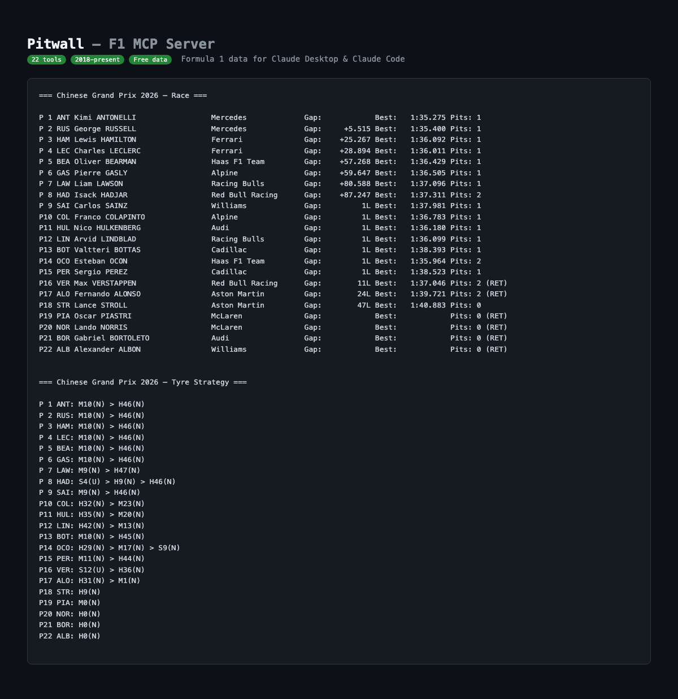
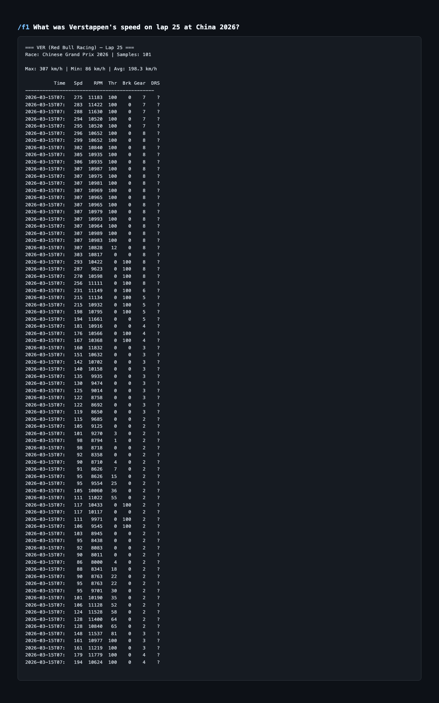

# Pitwall

**The F1 data command center for Claude.** 69 tools covering race results, lap-by-lap telemetry, tyre strategy, pit stops, weather, race control, driver comparisons, visual plots, and historical data back to 1950.

Works with **Claude Desktop**, **Claude Code**, and any MCP-compatible client.



---

## Setup

### Step 1: Clone and install

```bash
git clone https://github.com/darshjoshi/pitwall.git
cd pitwall
```

**Choose your mode:**

```bash
# Lite (15 tools) — race results, telemetry, strategy, pit stops, weather, historical
pip install "mcp[cli]" requests

# Full (69 tools) — adds FastF1 visual plots, deep analysis, live data tools
pip install -r requirements-full.txt
```

> Pitwall auto-detects what's installed. No FastF1? It starts with 15 tools. Install FastF1 later? Restart and you get 69. No config changes needed.

### Step 2: Connect to Claude

<details>
<summary><strong>macOS</strong></summary>

**Claude Code:**
```bash
claude mcp add pitwall -- python3 /absolute/path/to/pitwall.py
```

**Claude Desktop** — add to `~/Library/Application Support/Claude/claude_desktop_config.json`:
```json
{
  "mcpServers": {
    "pitwall": {
      "command": "python3",
      "args": ["/absolute/path/to/pitwall.py"]
    }
  }
}
```
</details>

<details>
<summary><strong>Windows</strong></summary>

**1. Find your Python path:**
```cmd
where python
```
This will return something like `C:\Users\YourName\AppData\Local\Programs\Python\Python313\python.exe` or `C:\Python313\python.exe`.

**2. Note where you cloned Pitwall:**
For example: `C:\Users\YourName\Projects\pitwall\pitwall.py`

**Claude Code (PowerShell):**
```powershell
claude mcp add pitwall -- python C:\Users\YourName\Projects\pitwall\pitwall.py
```

**Claude Desktop** — add to `%APPDATA%\Claude\claude_desktop_config.json`:

> To open this folder, press `Win + R`, type `%APPDATA%\Claude`, and hit Enter. If the `Claude` folder or `claude_desktop_config.json` doesn't exist, create them.

```json
{
  "mcpServers": {
    "pitwall": {
      "command": "python",
      "args": ["C:\\Users\\YourName\\Projects\\pitwall\\pitwall.py"]
    }
  }
}
```

> **Note:** Use double backslashes (`\\`) in the JSON path, or forward slashes (`/`) — both work. The command is `python` (not `python3`) on Windows.
</details>

<details>
<summary><strong>Linux</strong></summary>

**Claude Code:**
```bash
claude mcp add pitwall -- python3 /absolute/path/to/pitwall.py
```

**Claude Desktop** — add to `~/.config/Claude/claude_desktop_config.json`:
```json
{
  "mcpServers": {
    "pitwall": {
      "command": "python3",
      "args": ["/absolute/path/to/pitwall.py"]
    }
  }
}
```
</details>

### Step 3: Restart and ask

Restart Claude Code or Claude Desktop. Then ask anything:

> "Who won the 2026 Chinese GP?"
> "What was Verstappen's speed on lap 25 at China?"
> "Compare Hamilton vs Leclerc's tyre strategy"
> "Who won the 2005 world championship?"

### Optional: Upload the Skill (Claude Desktop)

For beginner-friendly F1 explanations, upload `SKILL.md` as a skill in Claude Desktop:
1. Open Claude Desktop → Settings → Skills → Upload
2. Drag and drop `SKILL.md` from this repo
3. Claude will now explain F1 jargon inline (DRS, undercut, compound, etc.)

---

## What You Can Ask

| Question | Tool Used |
|----------|-----------|
| "Who won the Chinese GP?" | `get_standings` |
| "What was Verstappen's speed on lap 25?" | `get_telemetry` |
| "Compare Hamilton vs Leclerc at China 2026" | `get_driver_comparison` |
| "What tyres did everyone use?" | `get_tyre_strategy` |
| "Fastest pit stop at Australia 2025?" | `get_pit_stops` |
| "When was the safety car?" | `get_race_control` |
| "Was it raining during the race?" | `get_weather` |
| "Top speeds at Monza 2024?" | `get_speed_traps` |
| "Norris's lap times in the race" | `get_lap_times` |
| "Who won the 2005 championship?" | `get_championship_standings` |
| "Plot Verstappen vs Hamilton speed trace" | `plot_telemetry_comparison` |
| "Show me the gear shift map at Monaco" | `plot_gear_shifts` |
| "Who gained the most positions?" | `compare_grid_to_finish` |
| "Overtakes in the race" | `detect_overtakes` |



---

## Live Race Data (Optional — F1 TV Required)

Pitwall includes a raw SignalR Core WebSocket client that connects directly to F1's live timing feed during races. Most data is free. Car telemetry and GPS positions require an F1 TV subscription.

### What's free vs what needs F1 TV

| Data | Free (no account) | F1 TV subscription |
|------|-------------------|-------------------|
| Race positions, gaps, lap times | Yes | Yes |
| Race control, flags, penalties | Yes | Yes |
| Weather, track status | Yes | Yes |
| Tyre compounds, stint info | Yes | Yes |
| Team radio URLs | Yes | Yes |
| **Car telemetry** (speed, RPM, throttle, brake) | No | **Yes** |
| **GPS positions** (X/Y/Z coordinates) | No | **Yes** |

> **Important:** All of this data (including telemetry and GPS) becomes **free** in the static archive ~30 minutes after a session ends. F1 TV is only needed for live telemetry *during* a race.

### Authenticating with F1 TV

If you have an F1 TV Access, Pro, or Premium subscription:

```bash
python3 auth_setup.py
```

This opens a browser window where you log in with your F1 TV account. The auth token is saved locally to `~/.f1token` and `~/Library/Application Support/fastf1/f1auth.json`.

**Token details:**
- It's a JWT (JSON Web Token) — not your password
- Expires every ~4 days — re-run `python3 auth_setup.py` to refresh
- Never uploaded anywhere — stays on your machine
- Only used by the SignalR client for live sessions
- Token stored at `~/.f1token` (macOS/Linux) or `%USERPROFILE%\.f1token` (Windows)

### Using the live client

```python
import asyncio
from signalr_client import F1LiveClient

async def main():
    # Free mode — timing, weather, race control (no auth needed)
    client = F1LiveClient(no_auth=True)

    @client.on("TimingData")
    def on_timing(data, timestamp):
        for num, info in data.get("Lines", {}).items():
            print(f"P{info.get('Position','?')} #{num} Gap: {info.get('GapToLeader','')}")

    @client.on("RaceControlMessages")
    def on_rc(data, timestamp):
        for msg in data.get("Messages", {}).values():
            print(f"[{msg.get('Flag', '')}] {msg.get('Message', '')}")

    await client.connect()

asyncio.run(main())
```

For full telemetry (speed, RPM, throttle, brake, GPS):

```python
from auth_setup import load_token

client = F1LiveClient(no_auth=False, auth_token=load_token())

@client.on("CarData.z")
def on_telemetry(data, timestamp):
    # Speed, RPM, throttle, brake, gear, DRS at ~4Hz per car
    ...

@client.on("Position.z")
def on_position(data, timestamp):
    # GPS X/Y/Z coordinates at ~4Hz per car
    ...
```

---

## Tools

### Lite Mode (15 tools)

Install: `pip install "mcp[cli]" requests`

Uses F1's free static archive (2018-present) and Jolpica API (1950-present). No API keys needed.

| Tool | Description |
|------|-------------|
| `list_seasons` | Available seasons (2018-present) |
| `list_races` | Full season calendar with dates |
| `get_race_info` | Session details and available data feeds |
| `get_standings` | Race classification — positions, gaps, best laps, pits |
| `get_lap_times` | Lap-by-lap times, filterable by driver and lap range |
| `get_telemetry` | Speed, RPM, throttle, brake, gear, DRS for a specific lap |
| `get_tyre_strategy` | Compound, stint length, new/used for every driver |
| `get_pit_stops` | All pit stops sorted by fastest |
| `get_race_control` | Flags, penalties, safety cars, investigations |
| `get_weather` | Air/track temp, rain, humidity, wind |
| `get_speed_traps` | Speed at 4 measurement points per driver |
| `get_driver_comparison` | Head-to-head: position, pace, strategy, pit stops |
| `get_team_radio` | Team radio clip URLs |
| `get_historical_results` | Race results from 1950 to present |
| `get_championship_standings` | Driver/constructor championships from 1950+ |

### Full Mode (69 tools)

Install: `pip install -r requirements-full.txt`

Everything in Lite, plus 54 FastF1-powered tools:

| Category | Tools |
|----------|-------|
| **Visual Plots** | `plot_telemetry_comparison`, `plot_gear_shifts`, `plot_multi_telemetry_comparison`, `plot_driver_telemetry_comparison` |
| **Telemetry Analysis** | `analyze_brake_points`, `analyze_rpm_data`, `analyze_drs_usage` |
| **Lap Analysis** | `get_lap_times_fastf1`, `get_deleted_laps`, `analyze_lap_consistency`, `get_fastest_sectors`, `get_personal_best_laps`, `compare_sector_times` |
| **Strategy** | `get_driver_tyre_detail`, `get_stint_analysis`, `compare_tire_compounds`, `compare_tire_age_performance`, `analyze_starting_tires`, `compare_strategies` |
| **Race Analysis** | `get_race_results`, `get_sprint_results`, `get_session_summary`, `get_fastest_lap_data`, `detect_overtakes`, `compare_grid_to_finish`, `get_qualifying_progression` |
| **Pit Stops** | `get_pit_stop_detail`, `get_fastest_pit_stops` |
| **Driver & Team** | `get_driver_info`, `get_driver_standings`, `get_constructor_standings`, `team_head_to_head`, `get_team_laps`, `analyze_long_run_pace` |
| **Track & Safety** | `get_circuit_info`, `get_track_status`, `get_track_record`, `get_race_control_messages`, `get_penalties`, `get_dnf_list` |
| **Speed & Position** | `get_speed_trap_comparison`, `get_position_changes`, `get_gap_to_leader` |
| **History** | `get_race_winners_history` |
| **Live Data** | `get_live_session_status`, `get_live_positions`, `get_live_lap_times`, `get_live_sector_times`, `get_live_telemetry`, `get_live_weather` |
| **Radio** | `get_driver_radio` (via OpenF1 API) |
| **Session** | `get_schedule`, `get_session_info`, `get_weather_data` |

---

## Data Sources

All core data is **free and requires no API keys**.

| Source | What it provides | Coverage | Auth needed? |
|--------|-----------------|----------|-------------|
| [F1 Static Live Timing](https://livetiming.formula1.com/static/) | Telemetry, timing, strategy, pit stops, weather, race control | 2018-present | No |
| [Jolpica-F1](https://api.jolpi.ca/ergast/f1/) | Historical results and championships | 1950-present | No |
| [FastF1](https://github.com/theOehrly/Fast-F1) (optional) | Enhanced telemetry analysis and plots | 2018-present | No |
| [F1 SignalR Core](https://livetiming.formula1.com/signalrcore) (optional) | Real-time race data during live sessions | Live only | Free for most data, F1 TV for telemetry |

---

## How It Works

Pitwall reads from F1's publicly available static timing archive — the same data that powers the official F1 app. After each session ends (~30 minutes), F1 publishes 33 data feeds per session including full car telemetry (speed, RPM, throttle, brake, gear, DRS at ~4Hz per car), GPS positions, tyre data, pit stops, and race control messages.

The telemetry tool (`get_telemetry`) correlates the timing stream with the car data stream to extract telemetry for a specific driver on a specific lap — something no other F1 MCP server does.

### Architecture

```
Claude ──MCP──> Pitwall ──HTTP──> livetiming.formula1.com/static/ (free)
                       ──HTTP──> api.jolpi.ca/ergast/f1/ (free)
                       ──lib──>  FastF1 (optional, local)
                       ──WS───> SignalR Core (optional, live races)
```

---

## Race Names

Race names are fuzzy-matched. All of these work:

```
"china", "chinese", "shanghai"          → Chinese Grand Prix
"australia", "melbourne", "aus"         → Australian Grand Prix
"monaco", "monte carlo"                 → Monaco Grand Prix
"silverstone", "uk", "great britain"    → British Grand Prix
```

## Driver Codes

```
VER = Verstappen    HAM = Hamilton    NOR = Norris     LEC = Leclerc
ANT = Antonelli     RUS = Russell     PIA = Piastri    BEA = Bearman
GAS = Gasly         LAW = Lawson      HAD = Hadjar     SAI = Sainz
ALO = Alonso        STR = Stroll      OCO = Ocon       BOT = Bottas
ALB = Albon         HUL = Hulkenberg  COL = Colapinto  LIN = Lindblad
```

---

## Project Files

| File | Purpose |
|------|---------|
| `pitwall.py` | MCP server — 69 tools, auto-degrades to 15 without FastF1 |
| `signalr_client.py` | Raw SignalR Core WebSocket client for live race data |
| `decompressor.py` | Zlib decompression for CarData.z / Position.z |
| `merger.py` | Keyframe + delta state management for F1's incremental format |
| `topics.py` | All 20 SignalR topics with auth/compression metadata |
| `auth_setup.py` | F1 TV token setup — browser-based OAuth flow |
| `SKILL.md` | Beginner-friendly skill for Claude Desktop (upload via Settings) |
| `CLAUDE.md` | Project context for Claude Code |
| `requirements.txt` | Lite dependencies |
| `requirements-full.txt` | Full dependencies (FastF1 + SignalR) |

---

## Running the Server

```bash
# MCP stdio (Claude Code / Claude Desktop)
python3 pitwall.py

# MCP HTTP (remote / self-hosted)
python3 pitwall.py --http
python3 pitwall.py --http --port 3000
```

---

## Credits

- [FastF1](https://github.com/theOehrly/Fast-F1) by @theOehrly — the gold standard F1 Python library
- [Jolpica-F1](https://github.com/jolpica/jolpica-f1) — the Ergast API successor
- [drivenrajat/f1](https://github.com/drivenrajat/f1) — inspiration for FastF1 tool patterns

---

## Built by

**Darsh Joshi** — AI Engineer

- LinkedIn: [linkedin.com/in/darshjoshi](https://linkedin.com/in/darshjoshi)
- Email: [contact@darshjoshi.com](mailto:contact@darshjoshi.com)
- GitHub: [github.com/darshjoshi](https://github.com/darshjoshi)

Questions, ideas, or want to contribute? Open an issue or reach out.

## License

MIT
